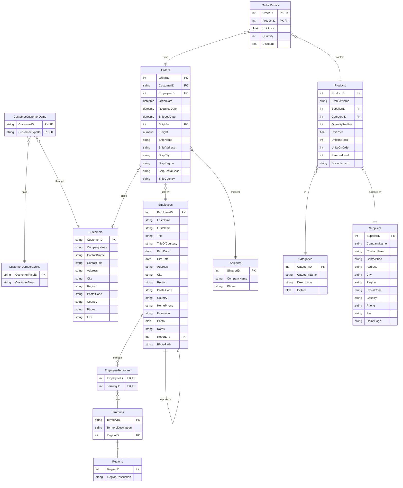

# Northwind-SQLite3

This is a version of the Microsoft Access 2000 Northwind sample database, re-engineered for SQLite3.

The Northwind sample database was provided with Microsoft Access as a tutorial schema for managing small business customers, orders, inventory, purchasing, suppliers, shipping, and employees. Northwind is an excellent tutorial schema for a small-business ERP, with customers, orders, inventory, purchasing, suppliers, shipping, employees, and single-entry accounting.

All the TABLES and VIEWS from the MSSQL-2000 version have been converted to Sqlite3 and included here. Included is a single version prepopulated with data. Should you decide to, you can use the included python script to pump the database full of more data.

[Download here](https://raw.githubusercontent.com/jpwhite3/northwind-SQLite3/main/dist/northwind.db)

# Structure



## Views

The following views have been converted from the original Northwind Access database. Please refer to the `src/create.sql` file to view the code behind each of these views.

| View Name |
|-----------|
| [Alphabetical list of products] |
| [Current Product List] |
| [Customer and Suppliers by City] |
| [Invoices] |
| [Orders Qry] |
| [Order Subtotals] |
| [Order Subtotals] |
| [Product Sales for 1997] |
| [Products Above Average Price] |
| [Products by Category] |
| [Quarterly Orders] |
| [Sales Totals by Amount] |
| [Summary of Sales by Quarter] |
| [Summary of Sales by Year] |
| [Category Sales for 1997] |
| [Order Details Extended] |
| [Sales by Category] |


# Build Instructions

## Prerequisites

- You are running in a unix-like environment (Linux, MacOS)
- Python 3.6 or higher (`python3 --version`)
- SQLite3 installed `sqlite3 -help`

## Build

```bash
make build  # Creates database at ./dist/northwind.db
```

## Populate with more data

```bash
make populate
```

## Print report of row counts

```bash
make report
```
